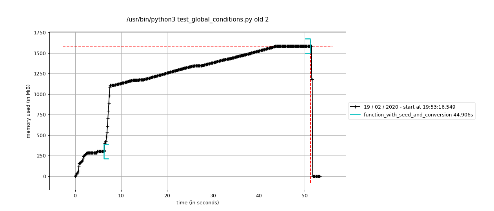
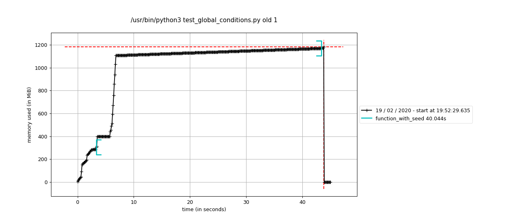
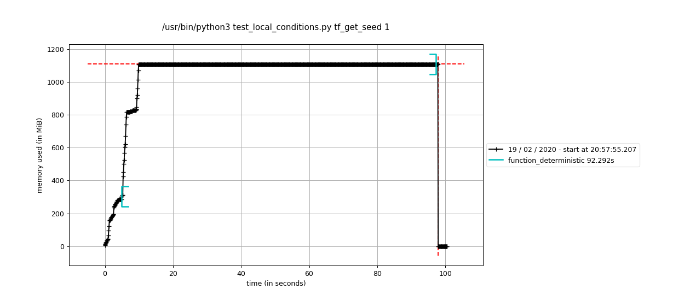
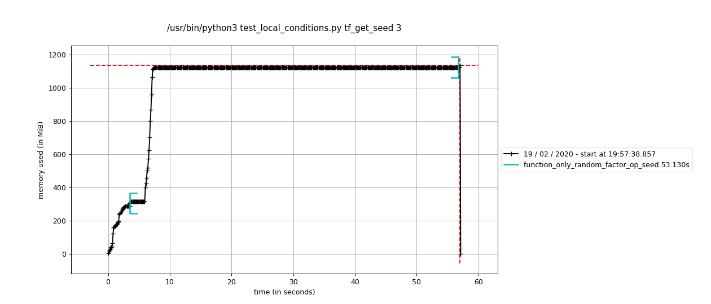
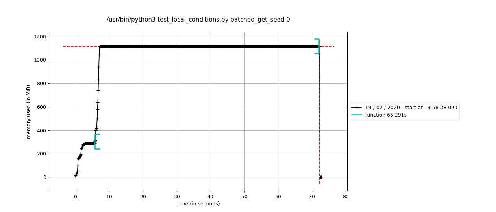
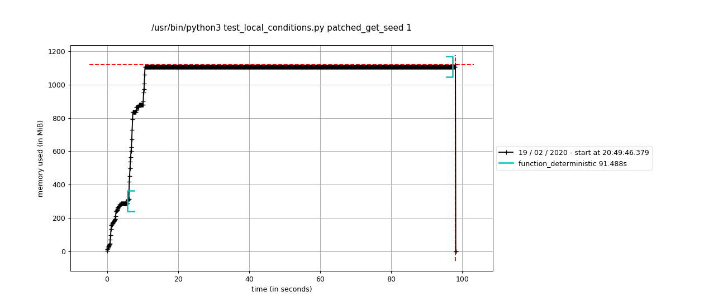
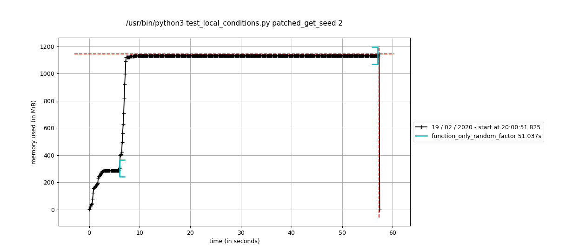
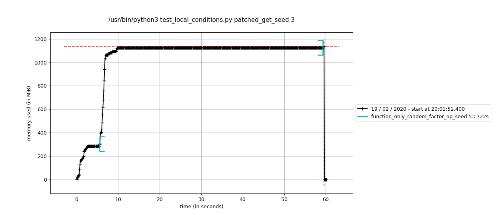

# tf-issue-36164-workaround

Gives the path to find the source of the bug of TensorFlow issue #36164 and a temporary workaround

## System information

- Have I written custom code (as opposed to using a stock example script provided in TensorFlow): yes
- OS Platform and Distribution (e.g., Linux Ubuntu 16.04): Linux Ubuntu 16.04
- Mobile device (e.g. iPhone 8, Pixel 2, Samsung Galaxy) if the issue happens on mobile device: Nope
- TensorFlow installed from (source or binary): binary (docker image)
- TensorFlow version (use command below): 2.1.0
- Python version: 3.6.9
- Bazel version (if compiling from source): N/A
- GCC/Compiler version (if compiling from source): N/A
- CUDA/cuDNN version: 10.1
- GPU model and memory: GeForce GTX TITAN X (12Go)

## Installing additional requirements while testing

Please use the docker image located [here](https://hub.docker.com/layers/tensorflow/tensorflow/2.1.0-gpu-py3-jupyter/images/sha256-901b827b19d14aa0dd79ebbd45f410ee9dbfa209f6a4db71041b5b8ae144fea5?context=explore).

```shell
pip install -r requirements.txt
```

## Generating the figures

```shell
bash generate_figures.sh
```

## Memory leak tracking

### Finding the cause by evaluating global conditions

The [this issue](https://github.com/tensorflow/tensorflow/issues/36164) was the first attempt of explaining the memory leak and show the global conditions to make it appear. The figures beginning by global in [figures](figures) show the memory profiling of these conditions.

### Finding the cause by evaluating local conditions

1. Looking at the memory monitoring results given in [this issue](https://github.com/tensorflow/tensorflow/issues/36164), the memory seems to leak only when a numpy conversion and a general seed is set. Actually, if we put all the curves on different scale, we also detect a memory leak when only the seed is set, but no conversion is made.

    |  With seed and conversion |  With seed only |
    |---|---|
    |  |  |

2. Hence, the conversion to `numpy` makes the leak worst, but exists even if there is no conversion. Let us dive in the inner working of the function in question. A `tf` random function on image is separated into a parameters random sampling step and a call to a deterministic function with these parameters. If we take for instance the simple `tf.image.random_contrast` function, we can see these steps at [these lines](https://github.com/tensorflow/tensorflow/blob/v2.1.0/tensorflow/python/ops/image_ops_impl.py#L1613).  We can therefore recreate our own simplified version of the two steps above instead of calling the random function to isolate the cause:

    ```python
    factor = tf.random.uniform([]) # step 1
    x = tf.image.adjust_contrast(x, factor) # step 2
    ```

3. When we remove the stochastic part and use a static `factor`, the memory leak disappears. This strongly suggests that it must come from the random sampling. The fact that the bug is caused by the general seed was already a good clue, but that confirms the root of the problem.

    

4. If we dig more into the inner working of `tf.random.uniform`, we remark that the way the general seed is influencing the sampling is by calling the `get_seed` function at [this line](https://github.com/tensorflow/tensorflow/blob/e5bf8de410005de06a7ff5393fafdf832ef1d4ad/tensorflow/python/ops/random_ops.py#L267). If we look at the [`get_seed`](https://github.com/tensorflow/tensorflow/blob/e5bf8de410005de06a7ff5393fafdf832ef1d4ad/tensorflow/python/framework/random_seed.py#L39) function source code, we understand that each time a seed is asked by a tensorflow op, it calls this function to receives a global seed and an op_seed as described in details [here](https://www.tensorflow.org/api_docs/python/tf/random/set_seed). Let us isolate the source of the bug:

    1. First, we are in eager mode per default since we are in tf>2.0 and we can ignore all the cases that concern graphs.
    2. Second, we are interested in the case where the global seed is not `None` since it leaks when it is set.
    3. That leaves us with either a `op_seed = None` ([line 69](https://github.com/tensorflow/tensorflow/blob/e5bf8de410005de06a7ff5393fafdf832ef1d4ad/tensorflow/python/framework/random_seed.py#L69)) or a `op_seed != None` (directly to [line 74](https://github.com/tensorflow/tensorflow/blob/e5bf8de410005de06a7ff5393fafdf832ef1d4ad/tensorflow/python/framework/random_seed.py#L74)).

5. With step 4, we can greatly suspect that the memory leaks is caused by the `op_seed` creation linked to the eager context at [line 70](https://github.com/tensorflow/tensorflow/blob/e5bf8de410005de06a7ff5393fafdf832ef1d4ad/tensorflow/python/framework/random_seed.py#L70), because the other case does almost nothing. Nevertheless, let us try if using a define `op_seed` removes the memory leaks. As we can see below it does and confirms that the bug lies at [line 70](https://github.com/tensorflow/tensorflow/blob/e5bf8de410005de06a7ff5393fafdf832ef1d4ad/tensorflow/python/framework/random_seed.py#L70).

    

6. [Line 70](https://github.com/tensorflow/tensorflow/blob/e5bf8de410005de06a7ff5393fafdf832ef1d4ad/tensorflow/python/framework/random_seed.py#L70) calls [line 1643 in eager/context.py](https://github.com/tensorflow/tensorflow/blob/e5bf8de410005de06a7ff5393fafdf832ef1d4ad/tensorflow/python/eager/context.py#L1643). This method samples an `op_seed` from a local random number generator *dependant of the global seed* that *belongs to the eager context class*. For now, we do not know how, but it probably creates a reference cycle that prevents the tensors to be flushed by the python garbage collector.

### Proposing a workaround

We understand the need to have an `op_seed` generated by the global seed when this global seed is set and the `op_seed` is `None`, but if in your use case, it is a bit useless since always having the same `op_seed` is ok, you can use this workaround. We can then monkey patch the `get_seed` function with the package [gorilla](https://github.com/christophercrouzet/gorilla) with this very simple surrogate:

```python
# pylint: disable=no-name-in-module,import-error
from tensorflow.python.eager import context
from tensorflow.python import pywrap_tensorflow
from tensorflow.python.framework import random_seed

# Defines the default op seed
DEFAULT_OP_SEED = 1923746

# Defines the function
def patch_get_seed(global_seed, op_seed):
    if op_seed is not None:
        return global_seed, op_seed
    else:
        return global_seed, DEFAULT_OP_SEED

# Monkey Patch get_seed.
func = lambda op_seed: better_get_seed(seed, op_seed)
settings = gorilla.Settings(allow_hit=True, store_hit=True)
patch = gorilla.Patch(
    random_seed, 'get_seed', func, settings=settings)
gorilla.apply(patch)

# Also clear the kernel cache, to reset any existing seeds
# pylint: disable=protected-access
_context = context.context()
if _context._context_handle is not None:
    pywrap_tensorflow.TFE_ContextClearCaches(_context._context_handle)
```

If we use this patch, there is no leak anymore in any case:

|||
|---|---|
|  |  |
|  |  |
